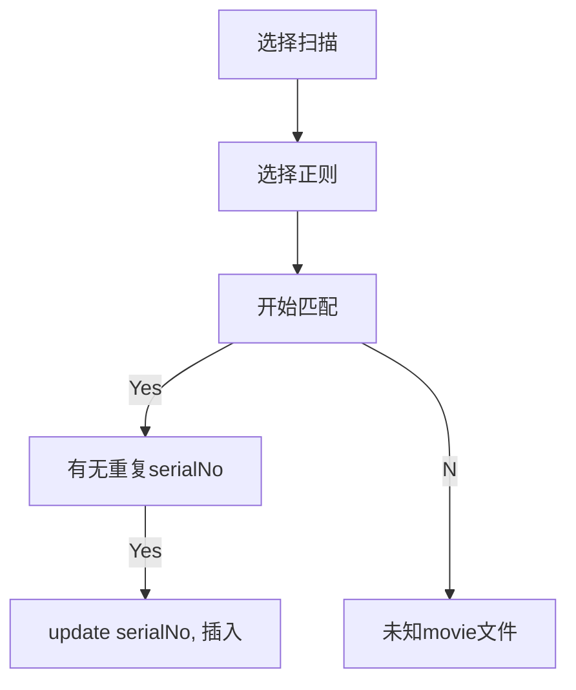

# 运行
```shell
yarn start # 启动umi
yarn startui # 启动electron
```
# 文件
src/pages/下面

# 进度
- 扫描磁盘文件
- 录入数据库

# TODO
- 分离serialNo
- 关联`扫描`和`serialNo`

```mermaid
graph TB
a[选择扫描]
b[选择正则]
c[开始匹配]
d[有无重复serialNo]
f[update serialNo, 插入]
e[未知movie文件]

a --> b
b --> c
c --Yes--> d
c --No--> e
d --Yes--> f

```
- 搜刮 serialNo
....