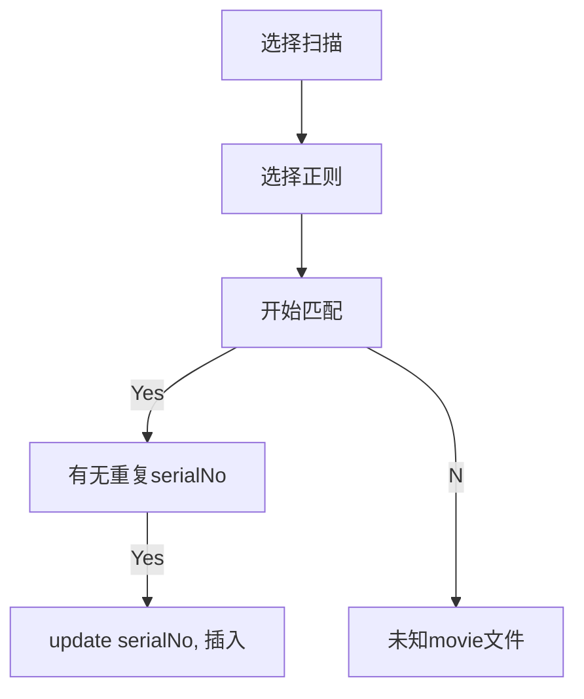

# 运行
```shell
yarn start # 启动umi
yarn startui # 启动electron
```
# 文件
src/pages/下面

# 进度
- 扫描磁盘文件
- 录入数据库

# TODO

- 扫描结果归并，磁盘文件增量后 需要补扫，需要把之前的审核结果复制到新的扫描中
  - SerialNo 中选择一个扫描结果
  - 该扫描结果中的每个文件拿出，然后到其他扫描结果中找同样文件名的，复制其serialNo属性回本文件名中


- 把 puppeteer 改成 调用py的seleium吧 这个调试好麻烦啊
- 去片头
  - 文件夹
  - 文件 - 片头截图
  - 输入去掉时长
  - 批量运行截断操作
- 分离serialNo
- 关联`扫描`和`serialNo`

- 搜刮 serialNo
....